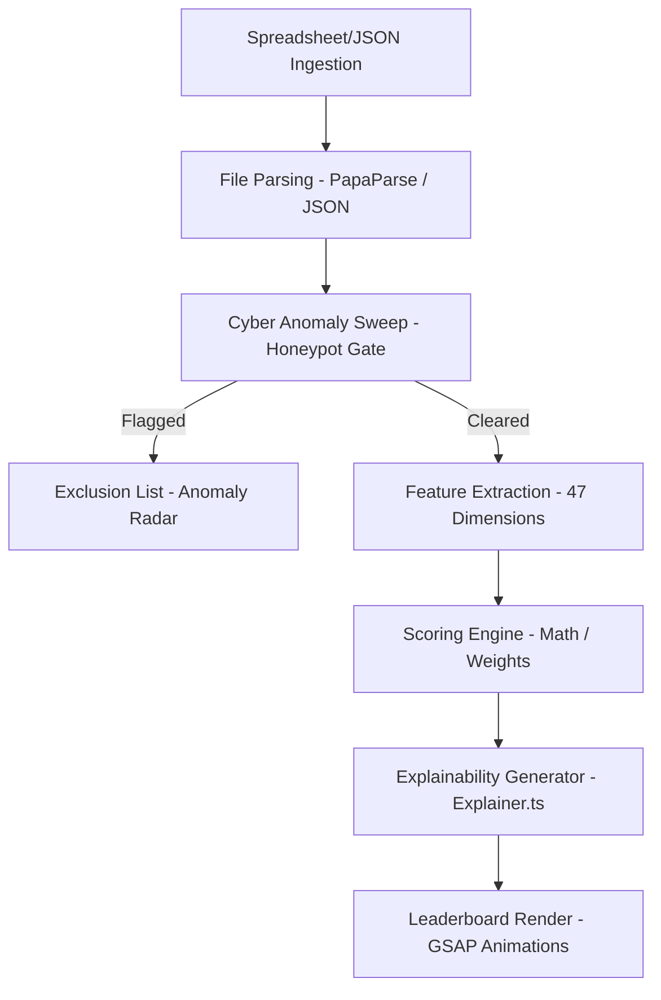

# RecruitIQ Engine — Project Documentation & Presentation Guide

This document is divided into two sections:
1. **Presentation Slides Outline** (Structured slide-by-slide for easy PowerPoint/Google Slides creation).
2. **Detailed Project Manual** (A comprehensive guide on the problem statement, solution, tech stack, and logic).

---

# SECTION 1: Presentation Slides (PPT-Wise Content)

## Slide 1: Title Slide
*   **Slide Title:** RecruitIQ: Neural Candidate Fit Scoring & Security Auditing
*   **Subtitle:** Next-Generation Talent Screening and Integrity Verification
*   **Presenter Info:** Enterprise Recruitment Engine
*   **Visual Suggestion:** Minimalist cyber-dark style with glowing accent nodes.

## Slide 2: The Core Problem Statement
*   **Slide Title:** The Resume Screening Crisis
*   **Bullet Points:**
    *   **Volume Overload:** Recruiter attention is spread thin over thousands of applications.
    *   **Lack of Standardization:** Standard parsers do not verify skill competence, depth, or context.
    *   **The Ingestion Attack Vector:** Increasing volume of fraudulent candidate profiles ("Honeypots") that stuff keywords to bypass ATS filters.
    *   **Subjective Bias:** Hard-skills matches are often influenced by recruiter subjectivity rather than uniform features.

## Slide 3: The Solution — RecruitIQ
*   **Slide Title:** Intelligent Screening & Integrity Auditing
*   **Bullet Points:**
    *   **Deterministic Ingestion Gate:** Audits candidate timelines, years of experience, and skill durations before ranking.
    *   **47-Dimension Feature Vector:** Extracts numeric and boolean signals across skills, careers, location, education, and activity metrics.
    *   **Linear & Neural Scoring:** Baseline weighted fit scoring and LightGBM model matching to prioritize high-intent, elite-tier talent.
    *   **High-Speed SPA Dashboard:** Real-time client-side evaluation with visual leaderboard charts and instant CSV workspace outputs.

## Slide 4: Technology Stack
*   **Slide Title:** The RecruitIQ Tech Stack
*   **Bullet Points:**
    *   **Frontend Core:** Next.js 16 (React, App Router, TypeScript) for modular, high-speed routing.
    *   **Interactive Graphics:** GSAP (GreenSock) for parallax hero banners and staggered card transitions; HTML5 Canvas for real-time mouse-interactive particle networks.
    *   **Smooth Motion:** Lenis Scroll integration for inertia-based smooth scrolling.
    *   **Data Processing:** PapaParse for client-side CSV parsing.
    *   **Scoring & Security Algorithms:** Self-contained TypeScript scoring modules (`lib/scorer.ts`) translating logic directly from Python prototypes (`pandas`, `LightGBM`, `scikit-learn`).

## Slide 5: How It Works — Integrity Sweep (Honeypot Predicates)
*   **Slide Title:** Threat Filtering (Honeypot Gate)
*   **Bullet Points:**
    *   **Timeline Sanity:** Flags overlapping non-current roles and future/impossible start dates.
    *   **Framework Launch Limits:** Flags claims like "10 years of experience in FastAPI" (FastAPI was released in 2018).
    *   **Expert stuffing:** Flags candidates with 12+ expert/advanced skills but zero endorsements and short durations.
    *   **Stated vs. Actual YOE:** Flags profiles where stated years of experience vastly exceed what the career history timelines support.
    *   **Role Mismatches:** Detects marketing/sales titles claiming multiple high-proficiency ML engineering skills.

## Slide 6: How It Works — Scorer & Features
*   **Slide Title:** Feature Engineering & Scoring Math
*   **Bullet Points:**
    *   **Hard Skills Match:** Weighted matches against Job Description taxonomy with proficiency multipliers.
    *   **Career Timeline Analysis:** Preferential curves for target YOE bands (e.g. 6-8 years) and product company ratio checks.
    *   **Behavioral Signals:** Factoring response rates, notice periods, and contact verification into a trust score.
    *   **Scoring Equation:** Sum of 47 normalized feature vectors multiplied by customized linear weights, clamped to a [0, 1] range.

## Slide 7: Business Impact & Summary
*   **Slide Title:** Reimagining Technical Recruitment
*   **Bullet Points:**
    *   **Zero Fraud Ingestion:** Filters out artificial candidate profiles instantly.
    *   **Reduced Screening Latency:** Evaluates thousands of nodes in-browser in under 20ms.
    *   **Data-Driven Selection:** Objective rankings backed by detailed structural fit explainers.
    *   **Ready to Deploy:** Fully compatible with Vercel serverless and edge hosting.

---

# SECTION 2: Detailed Technical Project Manual

## 1. Executive Summary & Problem Statement
In technical recruitment, screening candidates for highly specialized roles (such as AI/ML Engineers) is bottlenecked by two critical problems: **volume** and **fraud**. 

Standard Applicant Tracking Systems (ATS) rely on simple keyword matching. This encourages **"keyword stuffing"** and **honeypot profiles**—fraudulent resumes where candidates copy-paste technical definitions, claim impossible years of experience, or overlap employment dates to trick automated filters. Recruiters are left with a polluted candidate pool, forcing them to manually audit career history timelines, check release dates of technologies, and guess fit scores.

**RecruitIQ Engine** solves this by establishing a secure talent matching pipeline that combines a deterministic threat-filter (Honeypot Gate) with a comprehensive 47-dimension scoring engine.

---

## 2. Core Solutions & System Logic

### The Honeypot Gate (Security Predicates)
Before scoring occurs, every candidate node is audited against six deterministic constraints:
1.  **Timeline Impossibility:** Verifies that no start date is in the future or older than 1970, durations are under 40 years, and non-current roles do not overlap by more than 6 months.
2.  **Framework Age Impossibility:** Rejects candidates whose claimed duration in a framework exceeds its actual launch year (e.g., claiming 12 years of React or 8 years of FastAPI).
3.  **Zero-Duration Expert:** Rejects profiles claiming "Expert" proficiency in multiple skills but listing 0 months of duration.
4.  **Skill Stuffing:** Flags profiles claiming over 12 advanced/expert skills with an average endorsement count < 1.0 and average duration < 3 months.
5.  **YOE Discrepancies:** Checks if the stated overall Years of Experience aligns with the sum of durations from the career history.
6.  **Title-Skill Mismatch:** Detects non-technical titles (e.g., Marketing Manager) claiming numerous advanced AI/ML skills.

### Feature Scoring & Vector Formulation
Candidates who survive the Honeypot Gate are analyzed across 47 individual features grouped into 5 clusters:
*   **Skills (30% weight):** Density of AI keywords, vector DB skill count, Python capability, skill assessment performance, and endorsement weights.
*   **Career & Experience (20% weight):** Ideal YOE curves, product/startup company ratio, seniority matches, and average tenure length. Consulting/services experience, pure research, and domain disqualifiers are penalized.
*   **Behavioral Signals (25% weight):** Inbound profile views, recruiter response rates, interview completion rates, and GitHub activity scores.
*   **Trust & Verification (10% weight):** Linked LinkedIn profile, verified email, verified phone, and connection counts.
*   **Logistics & Location (15% weight):** Notice period length (immediate availability preferred) and geographic match with target cities.

---

## 3. Technology Stack & Architecture

The application has been redeveloped into a high-performance **Next.js** project optimized for **Vercel** deployment:
*   **Next.js (App Router, React, TypeScript):** Powers the modular client-side single page app (SPA).
*   **GSAP (GreenSock Animation Platform):** Coordinates complex animations—including scroll-parallax effects in the hero section and staggered fade-ins for candidate leaderboard entries.
*   **Lenis Scroll:** Smooth scroll library that normalizes mouse-wheel scroll physics, producing a premium, sleek feel.
*   **HTML5 Canvas API:** Renders an interactive neural particle network in the background of the hero section. Moving the mouse connects nearby nodes and repels particles.
*   **PostCSS / TailwindCSS v4:** Utility styles paired with custom HSL dark-theme tokens for a sleek developer console style.
*   **PapaParse:** Performs fast client-side CSV parser audits directly in the browser.

---

## 4. How It Works: Pipeline Execution Flow

1.  **Ingestion:** The recruiter uploads a candidate spreadsheet (CSV) or JSON array.
2.  **Schema Alignment:** The column headers are mapped to canonical properties (such as YOE, current title, and signal metrics).
3.  **Honeypot Filter:** The candidates are audited. Suspicious files are instantly sent to the **Anomaly Radar console**.
4.  **Fit Calculation:** Surviving candidates are evaluated across all 47 features.
5.  **Explainability:** The scoring math is fed to the template explainer to generate natural language explanations corresponding to their rank.
6.  **Leaderboard Display:** The grid card leaderboard animates into view showing percentage fit, core indicators, and the AI analysis block.
